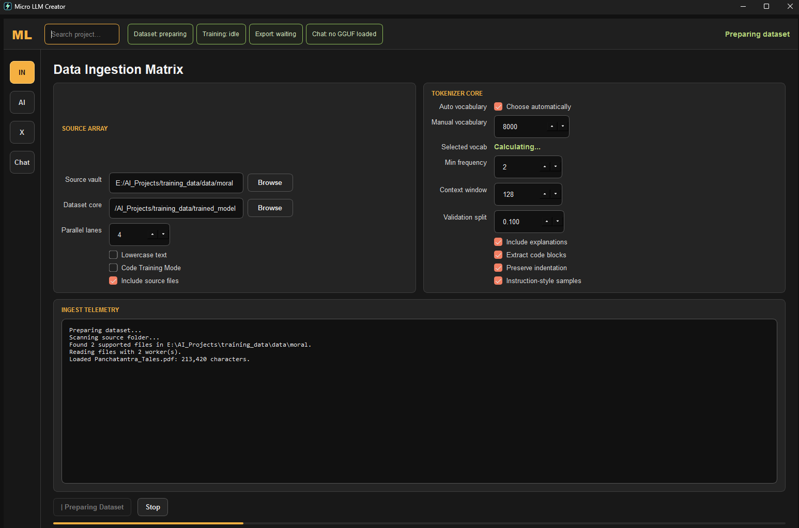
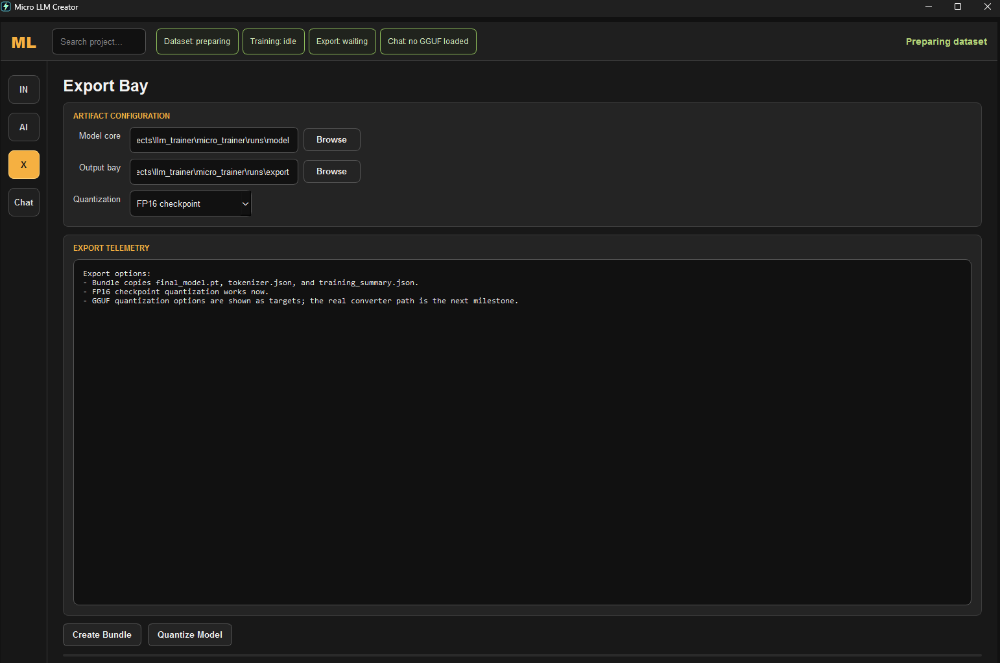
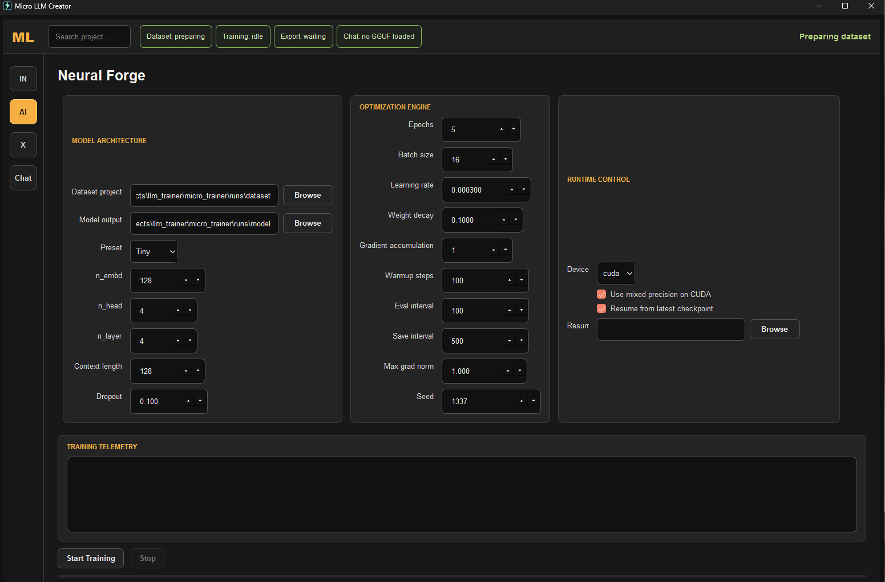
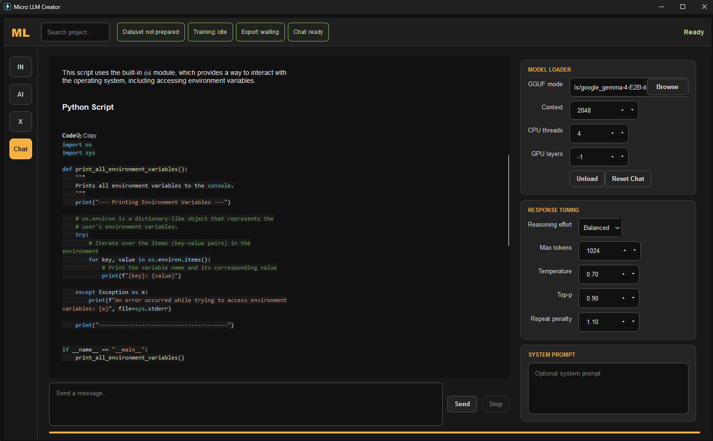

<p align="center">copyright @ Indra (Intelligent Network for Deliberation, Reasoning & Action)</p>

# Micro LLM Creator
<p align="center"></p>

Desktop app for preparing text/code datasets and training small
GPT-style language models.

Requires Python 3.9 or newer.

Launch the desktop app:

```bash
python3 run_app.py
```

On Linux/macOS, direct execution also needs:

```bash
chmod +x run_app.py
./run_app.py
```

If direct execution prints `Permission denied`, use `python3 run_app.py` or run
the `chmod` command above once after cloning.

## First backend commands

Prepare text/PDF/JSONL files:

```powershell
python -m llm_trainer.cli prepare --input_dir .\examples\tiny_corpus --output_dir .\runs\tiny_data --context_length 16
```

Prepare programming PDFs plus source files in code-aware mode:

```powershell
python -m llm_trainer.cli prepare --input_dir .\examples\tiny_corpus --output_dir .\runs\code_data --context_length 128 --code_training_mode
```

Code-aware mode keeps source-code files such as `.py`, `.js`, `.java`, `.cpp`,
`.cs`, `.go`, and `.rs`, preserves indentation, tags code/prose samples, and
tries to extract code-like blocks from PDFs/text.

Train a very small smoke-test model:

```powershell
python -m llm_trainer.cli train --data_dir .\runs\tiny_data --output_dir .\runs\tiny_model --epochs 1 --batch_size 2 --context_length 16 --embedding_size 32 --head_count 4 --layer_count 2 --device cpu --no_resume
```

Training saves checkpoints in the model folder and can resume from the latest
checkpoint by default. The UI exposes model options such as `n_embd`, `n_head`,
`n_layer`, context length, learning rate, batch size, warmup, checkpoint
interval, AMP, resume, and FP16 checkpoint quantization.

The TEST tab can load a `.gguf` model through `llama-cpp-python` and keep it in
memory for a ChatGPT-style local test chat with streamed, Markdown-rendered
replies. GPU offload is requested by default with `n_gpu_layers=-1`; install a
GPU-enabled llama-cpp-python build for actual CUDA/Metal acceleration.

For NVIDIA CUDA on Windows/Linux, first try the prebuilt CUDA wheel that matches
your CUDA runtime. Example for CUDA 12.4:

```bash
pip uninstall -y llama-cpp-python
pip install --no-cache-dir --force-reinstall llama-cpp-python --extra-index-url https://abetlen.github.io/llama-cpp-python/whl/cu124
```

Use `cu121`, `cu122`, `cu123`, `cu124`, `cu125`, `cu130`, or `cu132` to match
your installed CUDA version.

If you build from source instead, CUDA Toolkit must be installed and `nvcc` must
be on PATH:

```bash
pip uninstall -y llama-cpp-python
CMAKE_ARGS="-DGGML_CUDA=on" FORCE_CMAKE=1 pip install --no-cache-dir --force-reinstall llama-cpp-python
```

In PowerShell:

```powershell
pip uninstall -y llama-cpp-python
$env:CMAKE_ARGS="-DGGML_CUDA=on"
$env:FORCE_CMAKE="1"
pip install --no-cache-dir --force-reinstall llama-cpp-python
```

The GGUF path is intentionally not hand-written yet. The next export milestone is
to save a Hugging Face-compatible model folder and convert it through llama.cpp's
official converter tooling.
