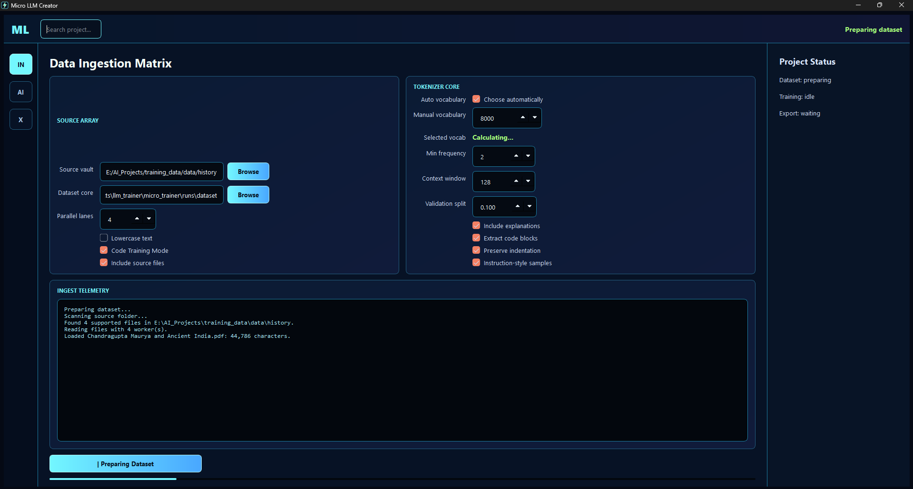

<p3 align="center">Copyright @ Intelligent Network for Deliberation, Reasoning & Action (INDRA)</p>
<p>contact - contact.nilesh.jadhav@gmail.com</p>

# Micro LLM Creator
<p align="center">
  
</p>
Backend foundation for a PySide6 app that prepares text datasets and trains
small GPT-style language models.

## First backend commands

Prepare text/PDF/JSONL files:

```powershell
python -m llm_trainer.cli prepare --input_dir .\examples\tiny_corpus --output_dir .\runs\tiny_data --context_length 16
```

Prepare programming PDFs plus source files in code-aware mode:

```powershell
python -m llm_trainer.cli prepare --input_dir .\examples\tiny_corpus --output_dir .\runs\code_data --context_length 128 --code_training_mode
```

Code-aware mode keeps source-code files such as `.py`, `.js`, `.java`, `.cpp`,
`.cs`, `.go`, and `.rs`, preserves indentation, tags code/prose samples, and
tries to extract code-like blocks from PDFs/text.

Train a very small smoke-test model:

```powershell
python -m llm_trainer.cli train --data_dir .\runs\tiny_data --output_dir .\runs\tiny_model --epochs 1 --batch_size 2 --context_length 16 --embedding_size 32 --head_count 4 --layer_count 2 --device cpu --no_resume
```

Training saves checkpoints in the model folder and can resume from the latest
checkpoint by default. The UI exposes model options such as `n_embd`, `n_head`,
`n_layer`, context length, learning rate, batch size, warmup, checkpoint
interval, AMP, resume, and FP16 checkpoint quantization.

The GGUF path is intentionally not hand-written yet. The next export milestone is
to save a Hugging Face-compatible model folder and convert it through llama.cpp's
official converter tooling.
